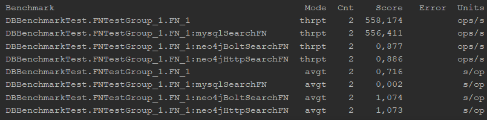
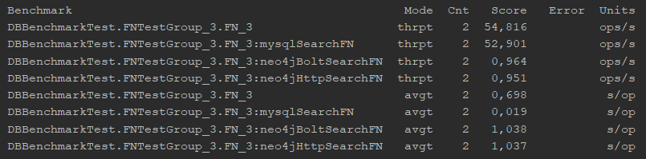

**Environment: Windows 10, Java 11, Maven 3.6.0, neo4j 3.5.8, MySQL 8.0.17**

**Steps for neo4j setup:**

1. Download and install Neo4j community server 
   https://neo4j.com/download-center/#community
   
2. Optional - install neo4j as a service

3. After installation server will be available at http://localhost:7474 
   On first login you will be prompt to change default password
   
4. Download and put into NEO4J_HOME\plugins apoc library ( Awesome Procedures On Cypher ) 
   https://github.com/neo4j-contrib/neo4j-apoc-procedures#version-compatibility-matrix
   
5. Update NEO4J_HOME\conf\neo4j.conf
   
   uncomment if needed: 
   dbms.directories.plugins=plugins
   
   uncomment if needed and set values according your environment: 
   dbms.memory.heap.initial_size=2048m 
   dbms.memory.heap.max_size=4096m
   
   add: 
   dbms.security.procedures.whitelist=apoc.* 
   apoc.export.file.enabled=true
   
6. Optional - if neo4j installed as a service run command when server is stopped 
   neo4j update-service
   
7. Use cypher scripts from folder _neo4j-search/script_ to create or cleanup nodes and relationships

   mobile network 
   type <path-to>\mn_create.cypher | cypher-shell -u <username> -p <password> --format plain 
   type <path-to>\mn_cleanup.cypher | cypher-shell -u <username> -p <password> --format plain
   
   friends network 
   type <path-to>\fn_create.cypher | cypher-shell -u <username> -p <password> --format plain 
   type <path-to>\fn_cleanup.cypher | cypher-shell -u <username> -p <password> --format plain
 
**Steps for MySQL setup:**

1. Download and install MySQL Installer 
   https://dev.mysql.com/downloads/windows/installer/
   
2. Use mysql scripts from folder _mysql-search/script_ to create or cleanup schemas
	
	for friends network is better to import dump from below link (script for create takes about 30 mins) 
	[friends network dump](https://drive.google.com/open?id=1f1PIzBRK2PH-EmeNN5iyvfvXhdChUXJZ)
	
	[mysql server settings used for test](https://drive.google.com/open?id=1nvF4XyQOKvAEPfQI_NApdwcv2VK7Ahzg)
   

**Benchmark results:**

Mobile network - count 4G sectors with azimuth 0 for each controller

Friends network - find user friends who knows each other

Friends network - find friends of user friends who is not yet knows user

Friends network - find user friends who friends only with user and user have more than 1 friend

